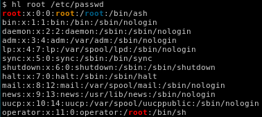
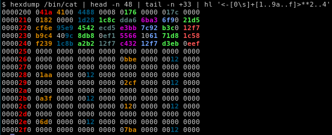
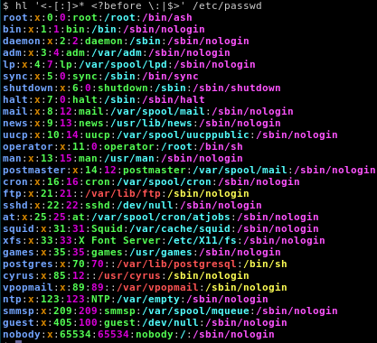
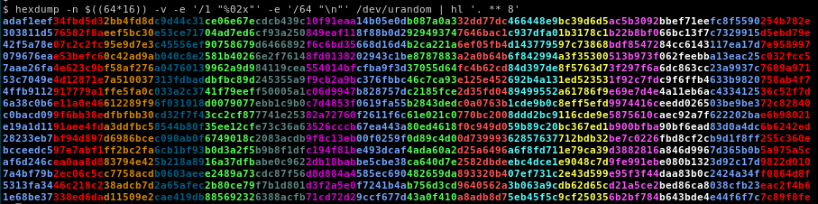
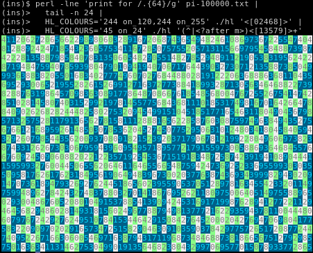

# Name
hl

# Synopsis
Colourise and highlight text in an output stream

# Usage

    hl <perl6_regex> [<file>|-|< <file>|< <(<subshell expression>)]
    [shell_expression|command] | hl <perl6_regex>

# Environmental Variables

    HL_COLOURS='<colour_spec>,<colour_spec>' # CSV spec as per Terminal::ANSIColor

# Description
`hl` paints text regions of an output stream or file indicated by a given
[Perl 6 regular expressions](https://docs.perl6.org/language/regexes).

This is useful when you are looking for patterns 
in text but would like to preserve the context around it 
(like `grep` but not suppressing any output).

hl emerges out of a hacky (unreliable) bash alias I had lying around and the
need to [learn some practical Perl 6](https://www.learningperl6.com/).

# Examples

### Highlight pattern matches

The simplest use case - matching a word.

    hl root /etc/passwd

Here is an example using a more advanced (albeit trite) Perl6 regular expression

    hexdump /bin/cat |
      hl '<-[0\s]+[1..9a..f]> ** 2..4'

### Highlight text fields

Sometimes highlighting fields helps us find anomalies

    hl '<-[:]>* <?before \:|$>' /etc/passwd

### Highlight blocks of text

If you need a visual aid while staring at or reading from long blocks of text

    hexdump -n $((64*16)) -v -e '/1 "%02x"' -e '/64 "\n"' /dev/urandom |
      hl '. ** 8'

### π maze

And here's something fun with some [digits of π](https://www.angio.net/pi/digits/100000.txt)

    perl -lne 'print for /.{64}/g' pi-100000.txt |
      tail -n 32 | 
      HL_COLOURS='244 on_120, 244 on_255' hl '<[02468]>' |
      HL_COLOURS='45 on_24'               hl '(^|<?after m>) <[13579]>+' 

# See Also

* [github.com/ap/hl](https://github.com/ap/hl) -
  [Aristotle Pagaltzis](http://plasmasturm.org/)'s version of `hl` in perl 5
* [docs.perl6.org/language/regexes](https://docs.perl6.org/language/regexes#Literals)
  for reference on using Perl 6 Regular Expressions.
* [github.com/tadzik/Terminal-ANSIColor](https://github.com/tadzik/Terminal-ANSIColor)
  for colour specifications that `hl` uses via the `HL_COLOURS` environmental
  variable.

# TODO
* `hl` can be really slow for large amounts of input text.
* Suppress lines not matching patterns _a la_ grep.
* Support for highlighting individual regex captures.
* Support for nested regex captures.
* Detecting 256-colour capable terminals and falling back.

