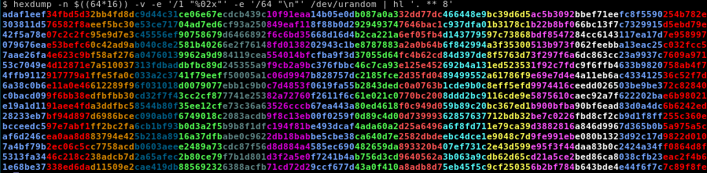

# Name
hl

# Synopsis
Colourise and highlight text in an output stream

# Usage

    hl <perl6_regex> [<file>|-]

# Description
hl paints text regions of an output stream or file indicated by a given
perl6 regular expression. This is useful when you are looking for patterns 
in text but would like to preserve the context around it 
(the opposite of `grep`).

hl emerges out of a hacky (unreliable) bash alias I had lying around and the
need to learn some practical Perl 6.

# Examples

### Highlight pattern matches
`hl` uses [Perl 6 regular expressions](https://docs.perl6.org/language/regexes)
to colourise text that match given patterns.

Here is an example of a more advanced Perl 6 regular expression

### Highlight text fields

Sometimes highlighting fields helps us find anomalies

### Highlight blocks of text

If you need a visual aid while staring at or reading blocks of text

### Mazes in π

And here's some fun

# See Also

* [ap/hl](https://github.com/ap/hl) - [Aristotle Pagaltzis](http://plasmasturm.org/)'s
  version of `hl` in perl 5
* [language/regexes](https://docs.perl6.org/language/regexes#Literals)

# TODO
* Suppress lines not matching patterns _a la_ grep.
* Support for highlighting individual regex captures.
* Support for nested regex captures.
* Detecting 256-colour capable terminals and falling back.
